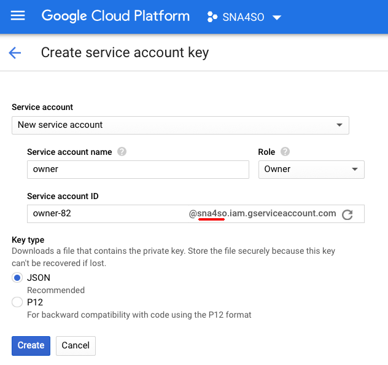

# Guida allo studente

## Indice
- Pipeline di progetto
- Passi preliminari
- Comunicazione del gruppo su Slack
- Accettazione progetto e creazione team su GitHub Classroom
- Configurazione Travis CI
- Aggiornamento badge in GitHub
- Configurazione locale del progetto
- Eseguire l'applicazione
- Lavoro sul codice dell’applicazione
- Test automatici e Controlli di Qualità
- Eseguire immagine docker
- Riferimenti

## Pipeline di progetto
La creazione e l'aggiornamento degli eseguibili coinvolge una *toolchain* in *pipeline* ovvero una serie di tool collegati in sequenza in modo che l'output del precedente sia l'input del successivo, come da figura.

Di seguito si riportano le istruzioni dettagliate per attivare la pipeline.  

## Passi preliminari
È necessario effettuare l’iscrizione a diversi servizi che saranno utilizzati durante tutto lo sviluppo del progetto. In particolare:

- Iscrizione a [**Slack**](https://slack.com/) con nome, cognome e foto
- Adesione al workspace Slack di progetto (softeng1819) mediante link mostrato dal docente a lezione
- Iscrizione a [**github.com**](https://github.com)
- Iscrizione a [**education.travis-ci.com**](https://education.travis-ci.com/) (tramite account GitHub)
- Iscrizione a [**docker.com**](https://www.docker.com) (un account per gruppo)

In aggiunta, occorre installare i seguenti strumenti:

- [**Slack**](https://slack.com/) per desktop e mobile
- [**Git**](https://git-scm.com/downloads)
- [**Docker**](https://www.docker.com/community-edition#/download)

Si suppone che lo studente abbia già installato sulla sua macchina l’ultima versione di **Eclipse  for Java Developers** disponibile.

## Comunicazione del gruppo
* Immettere i propri dati nel form Google Drive pubblicato su Slack
  - indicare come email quella usata o che si userà per l'iscrizione a Github
* Scrivere nello spreadsheet associato al form il proprio GitHub username
  - solo il cognome se non è ancora stata fatta l'iscrizione a GitHub; nel caso in seguito aggiornare
* Scrivere nello spreadsheet associato al form il nome del gruppo e i GitHub username dei componenti
  - il nome del gruppo deve essere un cognome di un vincitore del Turing Award, scritto tutto in minuscolo senza spazi e caratteri speciali
* Aggiornare il proprio profilo Slack con il nome del gruppo nel campo *What I do*
* Scrivere nello spreadsheet il Docker id di gruppo (uno solo si registra per tutto il gruppo)

Il nome del gruppo sarà il nome del repository su GitHub Classroom, Travis CI, docker.com.

## Accettazione progetto e accesso al repository di team su GitHub
Sarà necessario aspettare che il docente crei il team e il repository ad esso associato su GitHub.
Una volta creato il team, riceverete via email un invito a farne parte che dovrete accettare. 
Questo passo terminerà con successo se tutti i membri del gruppo potranno accedere al repository con URL ``` https://github.com/softeng1819-inf-uniba/progetto1819-<nome del gruppo> ```

## Configurazione Travis CI
Su invito esplicito del docente, dopo aver effettuato l’iscrizione e il login su *education.travis-ci.com* ed aver accettato l’assegnazione del progetto, occorrerà che uno dei componenti del gruppo esegua i seguenti passi di configurazione.

- Recarsi sulla propria pagina personale (cliccare sul proprio nome e foto di Github in alto a destra)
- Nella parte sinistra dell’interfaccia dovrebbe essere visibile l’organizzazione “IngSw 18-19, Informatica, UNIBA”. In caso positivo, selezionarla. In caso negativo provare a premere il bottone *Sync Account*.


- Selezionare la repository con il nome del proprio team, all’interno della pagina dell’organizzazione.
- Selezionare quindi *More options* e poi *Settings*


- Nelle sezioni *General* e *Auto Cancellation* selezionare le opzioni come da figura che seguente


- Nella sezione *Environment Variables*, tramite il tasto *Add*, definire le seguenti 4 Variabili d’ambiente:

	- **DOCKER\_ORGANIZATION**: il nome dell’organizzazione: **softeng1819infuniba**
	- **DOCKER\_PASSWORD**: la password dell'account di gruppo su *docker.com*
	- **DOCKER\_REPO**: il nome del repository di gruppo *(coincide con il nome del gruppo su Slack)*
	- **DOCKER\_USERNAME**: l'id dell’account di gruppo su *docker.com*


**N.B.:** è fondamentale che i nomi delle variabili d’ambiente siano scritti esattamente come sono riportati in questa guida.

## Aggiornamento badge in GitHub
Per aggiungere il badge di build status di Travis CI nel file README.md del repository su GitHub, a fianco del titolo del progetto (sna4so), seguire le istruzioni seguenti (vedi anche https://docs.travis-ci.com/user/status-images/):
- Cliccare sul *badge* accanto al nome della repository nella pagina del progetto su Travis CI (quello in grigio con su scritto (build|unknown)).
- Selezionare *Markdown*, anziché *Image URL*, nel secondo dropdown.
- Copiare il codice generato per aggiornare la riga del titolo nel file "README.md" nella cartella di progetto (potete anche usare direttamente l'editor di GitHub).

Il titolo del README.md dovrà apparire come nella seguente figura:


Il colore e lo stato del badge potranno cambiare dopo ogni build riflettendo lo stato del progetto.

## Configurazione Coveralls
Collegarsi al [sito](https://coveralls.io) (effettuando nuovamente il login tramite account GitHub, se necessario). Nel menu a comparsa sulla sinistra, selezionare la voce **+ ADD REPOS**. 
Il repository `softeng-inf-uniba/<nomegruppo>` dovrebbe essere immediatamente visibile nella pagina. Se non lo fosse, nel campo di testo digitare le prime lettere per renderlo visibile. Qualora ancora non fosse visibile, andate in fondo alla pagina e cliccata sul bottone **REFRESH PRIVATE REPOS**. 
Una volta visibile il progetto, cliccate sul tasto OFF, per trasformarlo in ON, come mostrato in figura.


Una volta attivato, cliccate su **DETAILS** per vedere il _token privato_ associato al repository da ricopiare nei file di configurazione del progetto. Precisamente.

* Aprite il file `.coveralls.yml` nella radice della cartella di progetto e aggiungete il _token privato_ al campo `repo_token:` , come nell'esempio sottostante:

  ```yml
  service_name: travis-pro
  repo_token: YOUR-PRIVATE-ALPHANUMERIC-TOKEN
  ```

* Aprite il file `.travis.yml` e copiate di nuovo il _token privato_ nel campo `COVERALLS_REPO_TOKEN=` come mostrato di seguito:

   ```yml
   env:
      global:
         - CI_NAME:travis-pro
         - COVERALLS_REPO_TOKEN=YOUR-PRIVATE-ALPHANUMERIC-TOKEN
   ```

### Aggiornamento badge Coveralls in GitHub

Ritornate sulla pagina details del sito di Coveralls (dove avete copiato il token). Spostatevi in basso, troverete una figura simile a quella mostrata qui sotto, la quale vi avvisa che il vostro progetto non ha ancora nessun badge incorporato nel file `README.md`.


Cliccate sul tasto **EMBED** e copiate il codice in formato Markdown. Il blocco assomiglierà a quello mostrato di sequito:
```
[](https://coveralls.io/github/softeng-inf-uniba/<NOME-GRUPPO>?branch=master)
```

Qualora il tasto **EMBED** non fosse visibile, nel menu a sinistra cliccate su _Settings_ (vi porterà a questo URL https://coveralls.io/github/softeng-inf-uniba/progetto1718-NOMEGRUPPO/settings)

Quindi, aprite il file `README.md` del vostro progetto, e incollate il codice di seguito a quello del badge di TRAVIS-CI. Alla fine, il file `README.md` dovrà mostrare due badge, simili a quelli in figura sottostante:


#### Troubleshooting
Qualora doveste accorgervi che il badge con il coverage non si aggiorna - nonstante le modifiche ai casi di test - potete forzare il refresh aggiungendo `&service=github` al link, come mostrato di seguito:

```
[](https://coveralls.io/github/softeng-inf-uniba/<NOME-GRUPPO>?branch=master)
```


## Configurazione locale del progetto
Per rendersi operativi con il progetto in locale, occorre seguire questi passi.

**Clonazione della repository remota**

Come prima attività, è necessario clonare la repository remota sulla propria macchina. Procedere come segue:

- Individuare la posizione nel proprio file system dove clonare la cartella di progetto. *Per evitare successivi problemi con l'importazione di Eclipse, evitare di salvare la cartella di progetto nella root del workspace di Eclipse*;
- Da terminale (Unix) o prompt dei comandi (Windows) spostarsi attraverso il comando *cd* nella cartella scelta al passo precedente;
- Scrivere il comando `git clone <url>` , dove l’url è quello visibile da GitHub premendo il bottone *Clone or Download*, in alto a destra nell’interfaccia. Ad esempio:


Se l’operazione è andata a buon fine, siamo quasi pronti per partire… Ma prima, è necessario importare il progetto in Eclipse!

**Configurazione di Eclipse**

Assicuarsi di aver installato [Java versione 8](https://www.oracle.com/technetwork/java/javase/overview/index.html) o superiore ed [Eclipse IDE for Java](https://www.eclipse.org/downloads/) versione 2018-12 (4.10.0) o superiore.

###### Installazione Google Cloud Tools

Dopo aver completato l'installazione, avviate Eclipse. Quindi, selezionate la voce del menu `Help > Eclipse Marketplace`.  Nella finestra, effettuate la ricerca delle parole chiave *Google cloud* per far comparire la componente *Google Cloud Tools for Eclipse*  come da figura.


Completate l'installazione e riavviate.

**Importazione del progetto in Eclipse**

Per importare correttamente il progetto in Eclipse, si dovrà seguire solo un semplice accorgimento: anziché creare un progetto Java (scelta di default), si opterà per la creazione di un progetto Gradle. Più nel dettaglio:

- Da *File* selezionare la voce *Import* per importare il progetto;
- Selezionare sotto la cartella *Gradle*, la voce *Existing Gradle Project*


- Dopo aver superato l’eventuale *Welcome*, bisognerà specificare come *Project root directory* la cartella di progetto clonata al passo precedente;
- A questo punto terminare l’operazione con *Finish*.


**Modifica della cartella di default per javadoc**

La cartella di default per la generazione di *javadoc* è la cartella `doc`. Per conformità con la struttura della repository di base del progetto, dovremo modificare il percorso e puntare a `nomeprogetto/doc/javadoc`:

- Premere il tasto destro sulla cartella di progetto di Eclipse. Scegliere quindi l’opzione *Properties*, in coda al menù contestuale;
- Individuare, tra le proprietà, quella denominata *Javadoc Location*;


- Tramite il pulsante *Browse*, selezionare il percorso **doc/javadoc** all’interno della cartella di progetto;
- Chiudere la finestra con *Apply and Close*.

###### Verifica setup librerie

Dopo aver importato il progetto, verificate la presenza delle librerie nel build path di Java.

Dall'albero di progetto nella vista *Navigator*, attivate il menu contestuale e selezionate al voce `Properties`, come da figura.


Quindi, selezionate la voce `Java Build Path` e verificate le seguenti librerie siano presenti come in figura. Qualora mancassero, procedete ad aggiungerle premendo il bottone `Add Library…`. I file `jar` richiesti sono salvati nella cartella `<nomeprogetto>/libs`.


## Eseguire l'applicazione

#### Attivare Google Service Account 

Questi passi devono essere eseguiti da un solo componente del gruppo di progetto. 

1. Collegarsi alla [Piattaforma Google Cloud](https://console.cloud.google.com/home/dashboard) (è richiesta autenticazione tramite account Google).
2. Create un nuovo progetto con il nome ***SNA4SO***, come in figura. L'altro campo non è necessario
   

3. Assicuratevi che il progetto sia selezionato nella dashboard, dopodiché dal menu a sinistra selezionate la voce `APIs & Services > Library`
4. Selezionare una per volta le API di ***Google BigQuery***, ***Drive*** e ***Spreadsheet*** e attivatele premendo il tasto `Enable`.
5. Selezionate la voce `APIs & Services > Credentials` della dashboard e create una ***Service account key*** come da figura.
   

6. Compilate i campi come da figura e create la chiave in formato JSON (NB. il valore del campo `Service Account ID` è generato automaticamente).
   

7. Rinominate il file JSON utilizzando il nome del vostro progetto; per esempio, se fate parte del progetto ***Allen***, la chiave dovrà chiamarsi `project-allen.json`.
8. Via Slack, inviate la chiave a Fabio Calefato ***come messaggio privato***.
9. Il file sarà accessibile all'URL: http://neo.di.uniba.it/credentials/DOCKERID.json, dove `DOCKERID` deve essere sostituito con il Docker ID usato per l'accesso a Docker Hub.
9. L'URL precedente deve essere usato per aggiornare l'attributo `url` nei file:
   * `SOQuery.java` (riga 36)
   * `GoogleDocsUtils.java` (riga 63)
10. Posizionatevi sul file `AppMain.java` ed eseguite come Java application da Eclipse.

## Lavoro sul codice dell’applicazione

Il workflow da utilizzare è il [GitHub Flow](https://guides.github.com/introduction/flow/) e prevede essenzialmente i seguenti passi:

- Subito prima di lavorare sul codice, è opportuno eseguire una `git pull` e lavorare sul codice più aggiornato
- Per ogni nuova *feature* *user story* o *bug fix* occorre creare o scegliere l’issue su cui lavorare su GitHub e segnarsi come **assigned**
- Creare un nuovo **branch** sul repository locale con il numero dell'issue o il titolo come nome del branch (*issue#n* oppure *titoloissue*) attraverso il comando `git branch <nome branch> `
- Spostarsi sul nuovo branch appena creato con il comando `git checkout <nome branch>` 	
- Lavorare al codice dell’applicazione. È consigliabile fare piccole **commit** autoconsistenti di volta in volta, con uno scopo ben preciso ed una descrizione dettagliata. *Evitare di fare un’unica grande commit alla fine del lavoro, a meno che la feature o il bug fix non sia davvero di poco conto.*
- Aggiorna con regolarità il branch sul server origin in GitHub con il comando `git push origin <nome branch>`
- Quando la modifica è stata correttamente implementata, si consiglia di scrivere adeguati test di unità per validarne la correttezza.
- Dopo l’esecuzione dei test è possibile lanciare gli strumenti di **Quality Assurance** (checkstyle e findbugs) per assicurarsi di aver scritto codice di qualità. Leggere la sezione *Controlli di Qualità* per ulteriori informazioni.
- A questo punto, dunque, si può procedere all'apertura di una pull request, andando su GitHub e posizionandosi sul branch su cui si sta lavorando.
- Scrivere un titolo conciso ed esplicativo per la pull request e una descrizione significativa per il revisore come commento, incluso un riferimento all'issue nella forma *closes #n*. Scegliere almeno un reviewer tra i componenti del team.
- Una volta lanciata la pull request, si attiverà la costruzione automatica della build e ci sarà da attendere qualche minuto. In caso di conflitti, bisogna risolverli. Può essere utile consultare la documentazione di GitHub (<https://help.github.com/articles/about-merge-conflicts/>) e comunicare con chi ha effettuato le modifiche in conflitto.  
- Discutere eventuali commenti dei reviewer e apportare le modifiche se necessarie come commit sul branch di lavoro. Ricordare che i commit aggiuntivi vanno comunque propagati sul repository remoto in GitHub mediante comando `git push origin <nome branch>`.
- Ricevuta l'approvazione esplicita di almeno un componente del team, si può procedere da GitHub al merge del nuovo *branch* con il *master branch* sul repository remoto.
- Se il merge è andato a buon fine, per completare il lavoro, cancellare il branch sul repository remoto (mediante interfaccia web di GitHub) e sul repository locale con la sequenza di comandi: `git checkout master`, `git pull` e `git branch -d <nome branch>`.

## Test automatici e Controlli di Qualità
È possibile misurare la copertura dei test automatici e operare dei controlli statici sulla qualità del codice Java (QA, quality assurance), grazie a strumenti come *JUnit*, *JaCoCo*, *Checkstyle*, *Findbugs*. Per lanciarli in un colpo solo si può utilizzare *Gradle*.

- Assicurarsi che sia aperta la vista *Gradle Tasks* in Eclipse. In caso negativo, dal menù *Window*, selezionare *Show View* e poi *Other*. La vista si troverà sotto la voce *Gradle*. Nell’eventualità che la vista non compaia, provare a cambiare *perspective* su Eclipse e selezionare *Java EE*: ciò si può fare o premendo Java EE dal bottone in alto a destra o da menù *Window-\>Perspective-\>Open Perspective-\>Other* e poi *Java EE*.
- Selezionare il nome del progetto e, tra le diverse opzioni, *verification*.
- Avviare il controllo attraverso l’operazione di **check**, che eseguirà automaticamente sia la build del progetto, sia i test di unità, sia i controlli di qualità.
- Aggiungere al controllo di versione la cartella `build/reports/` (**non** tutta la cartella `build/`), contenente i report degli strumenti.

 

- Per verificare gli errori, eventualmente individuati dagli strumenti di QA, si deve aprire la vista *Console*.

**N.B.** Nella configurazione attuale del progetto la presenza di errori non impedisce la corretta compilazione del codice. Si suggerisce, tuttavia, di limitare il più possibile *warnings* ed *errori* segnalati da questi strumenti.


## Esecuzione immagine docker
Dopo ogni operazione di push sul master branch remoto, Travis-CI tenta di compilare l’applicazione e, in caso di successo, esegue test e controlli di quality assurance. Nel caso in cui la compilazione e i test siano andati a buon fine, Travis-CI  ha il compito di caricare l’immagine del container su docker.com. Per essere certi che il codice non presenti problemi, occorre scaricare l’immagine da docker.com ed eseguire il container mediante l’installazione locale di Docker.

Si svolgano le seguenti operazioni:

- avviare Docker localmente (una volta aperta l’applicazione, bisogna attendere che nel menu di Docker compaia la scritta “Docker is running”)
- se si utilizza Windows selezionare `Switch to Linux containers` nel menu di Docker
- digitare nel terminale il seguente comando:`

		docker pull softeng1819infuniba/<nome_repository>

Nel caso specifico, **softeng1819infuniba** è il nome della organization che ospita i repository del corso.

Attendere che Docker scarichi l’immagine dell’applicazione.

- digitare il comando:

		docker run --rm softeng1819infuniba/<nome_repository>

L’applicazione verrà eseguita in un container sul computer locale. Il nome dell'applicazione coincide con il nome del repository e quindi non avrete modo di chiamare l'applicazione *sna4so*. Potrete invece passare parametri aggiungendo stringhe in coda al comando. Per esempio:

		docker run --rm softeng1819infuniba/<nome_repository> help

**N.B.:**
1. l’opzione `—-rm` serve per far sì che docker fermi l’esecuzione del container nel momento in cui l’applicazione eseguita al suo interno termina.
2. Si assume per default la versione *:latest* dell'immagine caricata su *docker.com* e quindi si omette di specificare esplicitamente il `<version_number>`
