# INDICE
1. [Introduzione](#Introduzione)
2. [Modello di dominio](#Modello-di-dominio)
3. [Requisiti specifici](#Requisiti-specifici)
4. [System Design](#System-Design)
    - [Stile architetturale adottato](#Stile-architetturale-adottato)
    - [Diagramma dei package](#Diagramma-dei-package)
    - [Diagramma dei componenti](#Diagramma-dei-componenti)
    - [Commenti](#Commenti-SD)
5. [OO Design](#OO-Design)
    - [Diagrammi delle classi e diagrammi di sequenza](#Diagrammi-delle-classi-e-diagrammi-di-sequenza)
    - [Design pattern utilizzati](#Design-pattern-utilizzati)
    - [Commenti](#Commenti-OO)
6. [Riepilogo del test](#Riepilogo-del-test)
7. [Manuale utente](#Manuale-utente)
8. [Processo di sviluppo e organizzazione del lavoro](#Processo-di-sviluppo-e-organizzazione-del-lavoro)
9. [Analisi retrospettiva](#Analisi-retrospettiva)
    - [Soddisfazioni](#Soddisfazioni)
    - [Insoddisfazioni](#Insoddisfazioni)
    - [Cosa ci ha fatto impazzire](#Cosa-ci-ha-fatto-impazzire)


# Introduzione
**SNA4SO** è una applicazione di ***social network analysis*** (*SNA*) applicata a [**Stack Overflow**](https://stackoverflow.com/) (*SO*), con interfaccia a linea di comando.

[***Social network analysis***](https://it.wikipedia.org/wiki/Analisi_delle_reti_sociali) è il processo di investigazione delle strutture sociali attraverso l'uso di reti e teoria dei grafi.

[***Stack Overflow***](https://it.wikipedia.org/wiki/Stack_Overflow_%28sito%29) è un sito web che fa parte della rete Stack Exchange in cui si possono porre domande riguardo a vasti argomenti di programmazione.

Il modello utilizzato per l'applicazione **SNA4SO** è un grafo orientato:
- I **nodi** sono gli utenti registrati sulla piattaforma **Stack Overflow**.
- Gli **archi** diretti partono dall’utente che risponde verso l'utente che ha posto una domanda.

L'applicazione opera su una *base di dati* a cui è possibile accedere in modalità *sola lettura* attraverso le *API* di **Google Big Query**. <br>
Il dump dei dati di Stack Overflow utilizzato risale al *2016/06*.

L'esecuzione avviene a linea di comando via [Docker](https://hub.docker.com/).

L'output dell'esecuzione di ***SNA4SO*** è un link ad uno *spreadsheet* creato attraverso le *API* di **Google API Services Sheets** e **Google API Services Drive**.

Tramite le opzioni inserite da riga di comando si possono analizzare le attività degli utenti (es. pone una domanda in *Maggio 2016*) e le loro interazioni con altri utenti (*es. utente 86 risponde alla domanda di utente 74560*). <br>
Le opzioni permettono di analizzare le domande/risposte relative ad un dato tag (*es. utenti che hanno risposto a domande con tag `matplotlib`*), una data specifica o anche visualizzare quanto spesso un utente specificato interagisce con altri utenti. <br>
È possibile decidere il limite massimo di risultati mostrati nello *spreadsheet*.

**SNA4SO** è stata realizzata durante il corso di [*INGEGNERIA DEL SOFTWARE*](http://www.di.uniba.it/~lanubile/ingsw/) dal gruppo ***dijkstra*** composto da:
- [Giuseppe Colavito](https://github.com/peppocola)
- [Antonio Fiore](https://github.com/AntoFlow)
- [Paolo Gasparro](https://github.com/paologas91)
- [Antonio Grisulli](https://github.com/GreenSully)
- [Lorenzo Loconte](https://github.com/loreloc)
- [Gianluca Losciale](https://github.com/LuzDeGea) <br>

Nell'anno accademico 2018/2019.

<br> <br>
[Torna all'indice...](#Indice)

# Modello di dominio

<center>
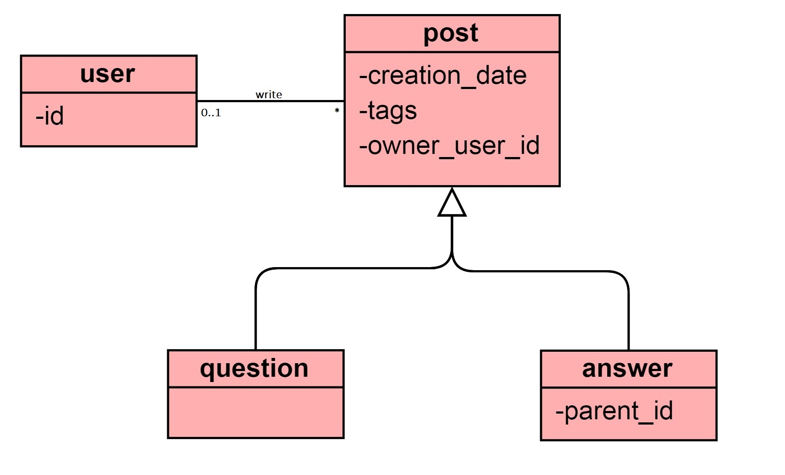
</center>

<br> <br>
[Torna all'indice...](#Indice)

# Requisiti specifici

* Visualizzare la lista dei primi 100 id utente (User) che hanno fatto almeno una domanda (Question) in un dato anno, mese e giorno

  Story points: 8

  Criteri di accettazione:
  Eseguendo il comando

  `docker run --rm softeng1819infuniba/dijkstra yyyy=2016 mm=02 dd=11 type=question limit=100`

  il risultato è una lista di owner_user_id univoci e non nulli, ordinati in modo crescente come da esempio in figura:

  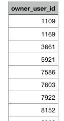

* Visualizzare la lista dei primi 100 id utente (User) che hanno dato almeno una risposta (Answer) in un dato anno, mese e giorno.

  Story points: 5

  Criteri di accettazione:

  Eseguendo il comando

  `docker run --rm softeng1819infuniba/dijkstra yyyy=2016 mm=02 dd=11 type=answer limit=100`

  il risultato è una lista di owner_user_id univoci e non nulli, ordinati in modo crescente come da esempio in figura:

  

* Visualizzare la lista dei primi 100 id utente (User) che hanno fatto almeno un Post in un dato mese, anno, giorno (un Post può essere una domanda o una risposta).

  Story points: 2

  Criteri di accettazione:

  Eseguendo il comando

  `docker run --rm softeng1819infuniba/dijkstra yyyy=2016 mm=02 dd=11 type=post limit=100`

  il risultato è una lista di owner_user_id univoci e non nulli, ordinati in modo crescente come da esempio in figura:

  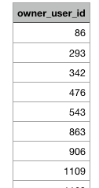

* Visualizzare la lista dei primi 100 id utente (User) che hanno fatto almeno una domanda (Question) su un dato argomento (Tag) in un dato mese e anno.

  Story points: 3

  Criteri di accettazione:

  Eseguendo il comando

  `docker run --rm softeng1819infuniba/dijkstra yyyy=2016 mm=02 type=question taglike=java limit=100`

  il risultato è una lista di owner_user_id univoci e non nulli, ordinati in modo crescente come da esempio in figura:

  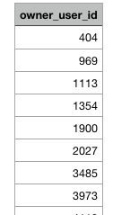

* Visualizzare la lista dei primi 100 id utente (User) che hanno dato almeno una risposta (Answer) su un dato argomento (Tag) in un dato mese e anno

  Story points: 8

  Criteri di accettazione:

  Eseguendo il comando

  `docker run --rm softeng1819infuniba/dijkstra yyyy=2016 mm=02 type=answer taglike=java limit=100`

  il risultato è una lista di owner_user_id univoci e non nulli, ordinati in modo crescente come da esempio in figura:

  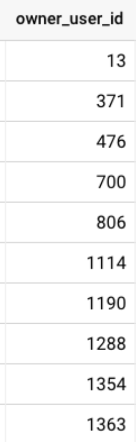

* Visualizzare la lista dei primi 100 id utente (User) che hanno fatto almeno un Post su un dato argomento (Tag) in un dato mese e anno (un Post può essere una domanda o una risposta)

  Story points: 5

  Criteri di accettazione:

  Eseguendo il comando

  `docker run --rm softeng1819infuniba/dijkstra yyyy=2016 mm=02 type=post taglike=java limit=100`

  il risultato è una lista di owner_user_id univoci e non nulli, ordinati in modo crescente come da esempio in figura:

  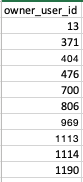

* Visualizzare la lista delle prime 100 coppie (from, to) relative a domande (Question) poste in un dato anno, mese e giorno

  Story points: 5

  Criteri di accettazione:

  Eseguendo il comando

  `docker run --rm softeng1819infuniba/dijkstra yyyy=2016 mm=02 dd=11 type=question edge=yes limit=100`

  il risultato è una lista come da esempio in figura:

  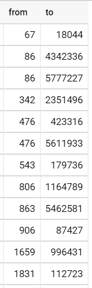


  - Verificare che per ogni domanda e risposta sia visualizzata una riga con la coppia (from, to) dove to è l'id dell'utente che ha posto la domanda e from è l'id dell'utente che ha risposto.
  - Verificare che le coppie (from, to) non contengano valori nulli
  - Verificare che le coppie (from, to) siano ordinate in modo crescente
  - Verificare che le coppie (from, to) non siano ripetute.

* Visualizzare la lista delle prime 100 coppie (from, to) relative a domande (Question) poste da un determinato utente.

  Story points: 3

  Criteri di accettazione:

  Eseguendo il comando

  `docker run --rm softeng1819infuniba/dijkstra type=question user=1109 edge=yes limit=100`

  il risultato è una lista come da esempio in figura:

  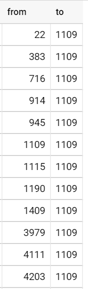


  - Verificare che per ogni domanda e risposta sia visualizzata una riga con la coppia (from, to) dove to è l'id dell'utente che ha posto la domanda, specificato come valore di user, e from è l'id dell'utente che ha risposto.
  - Verificare che le coppie (from, to) non contengano valori nulli
  - Verificare che le coppie (from, to) siano ordinate in modo crescente
  - Verificare che le coppie (from, to) non siano ripetute.

* Visualizzare la lista delle prime 100 coppie (from, to) relative a risposte (Answer) date da un determinato utente.

  Story points: 3

  Criteri di accettazione:

  Eseguendo il comando

  `docker run --rm softeng1819infuniba/dijkstra type=answer user=86 edge=yes limit=100`

  il risultato è una lista come da esempio in figura:

  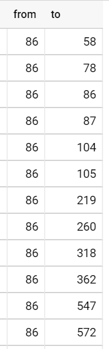


  - Verificare che per ogni domanda e risposta sia visualizzata una riga con la coppia (from, to) dove to è l'id dell'utente che ha posto la domanda e from è l'id dell'utente che ha risposto, specificato come valore di user
  - Verificare che le coppie (from, to) non contengano valori nulli
  - Verificare che le coppie (from, to) siano ordinate in modo crescente
  - Verificare che le coppie (from, to) non siano ripetute.

* Visualizzare la lista delle prime 100 triple (from, to, weight) relative a domande (Question) poste in un dato anno, mese e giorno

  Story points: 3

  Criteri di accettazione:

  Eseguendo il comando

  `docker run --rm softeng1819infuniba/dijkstra yyyy=2016 mm=02 dd=11 type=question edge=yes weight=yes limit=100`

  il risultato è una lista come da esempio in figura:

  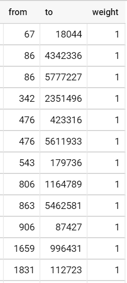


  - Verificare che per ogni domanda e risposta sia visualizzata una riga con la tripla (from, to, weight) dove to è l'id dell'utente che ha posto la domanda, from è l'id dell'utente che ha risposto e weight è il peso associato al numero di volte che l'utente from ha risposto all'utente to.
  - Verificare che le triple (from, to, weight) non contengano valori nulli,
  - Verificare che le triple (from, to, weight) siano ordinate in modo crescente
  - Verificare che non ci siano triple con (from, to) ripetuti.

* Visualizzare la lista delle prime 100 triple (from, to, weight) relative a domande (Question) poste da un determinato utente.

  Story points: 3

  Criteri di accettazione:

  Eseguendo il comando

  `docker run --rm softeng1819infuniba/dijkstra type=question user=1109 edge=yes weight=yes limit=100`

  il risultato è una lista come da esempio in figura:

  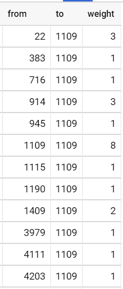


  - Verificare che per ogni domanda e risposta sia visualizzata una riga con la tripla (from, to, weight) dove to è l'id dell'utente che ha posto la domanda, specificato come valore di user, from è l'id dell'utente che ha risposto e weight è il peso associato al numero di volte che l'utente from ha risposto all'utente to.
  - Verificare che le triple (from, to, weight) non contengano valori nulli,
  - Verificare che le triple (from, to, weight) siano ordinate in modo crescente
  - Verificare che non ci siano triple con (from, to) ripetuti.

* Visualizzare la lista delle prime 100 triple (from, to, weight) relative a risposte (Answer) date da un determinato utente.

  Story points: 3

  Criteri di accettazione:

  Eseguendo il comando

  `docker run --rm softeng1819infuniba/dijkstra type=answer user=86 edge=yes weight=yes limit=100`

  il risultato è una lista come da esempio in figura:

  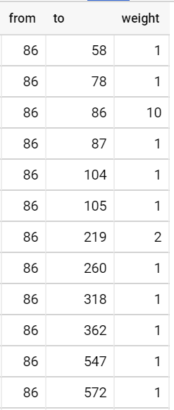


  - Verificare che per ogni domanda e risposta sia visualizzata una riga con la tripla (from, to, weight) dove to è l'id dell'utente che ha posto la domanda, from è l'id dell'utente che ha risposto, specificato come valore di user, e weight è il peso associato al numero di volte che l'utente from ha risposto all'utente to.
  - Verificare che le triple (from, to, weight) non contengano valori nulli,
  - Verificare che le triple (from, to, weight) siano ordinate in modo crescente
  - Verificare che non ci siano triple con (from, to) ripetuti.

<br> <br>
[Torna all'indice...](#Indice)

# Manuale utente

* Esecuzione via Docker attraverso il comando:
```bash
docker run --rm softeng1819infuniba/dijkstra <options>
```
* `options` include i seguenti parametri di input:
   - `type`: il tipo di post cercato in Stack Overflow, definito in `{question,answer,post}` (es., `type=post`)
   - `yyyy`: l'anno in cui un post è stato creato (es., `yyyy=2012`)
   - `mm`: il mese in cui un post è stato creato (es., `mm=01`)
   - `dd`: il giorno in cui un post è stato creato (es., `dd=07`)
   - `taglike`: la sottostringa da cercare nei tag applicati alle domande (es., `taglike=java` varrà per le domande taggate con `java`, `java9`, etc.)
   - `limit`: il limite al numero di risultati da restituire in una query (es., `limit=1000`)
   - `edge`: l'opzione per indicare che l'output deve includere gli archi (es., `edge=yes`); il default è output di soli nodi
   - `weight`: l'opzione per indicare che l'output relativo agli archi deve includere anche i pesi (es. `weight=yes`); il default è output di archi senza pesi
   - `user`: l'id dell'utente che ha creato un post (es. `user=86`)

* Al termine di ogni esecuzione di sna4so (output):
  - i risultati di una query sono salvati in un Google Spreedsheet attraverso le relative API
  - l'applicazione stampa a console l'url per acceddere via web a tale foglio di calcolo
  - il foglio di calcolo è accessibile in lettura a chiunque abbia il link
  - il foglio di calcolo può essere salvato in locale in formato CSV

<br> <br>
[Torna all'indice...](#Indice)
